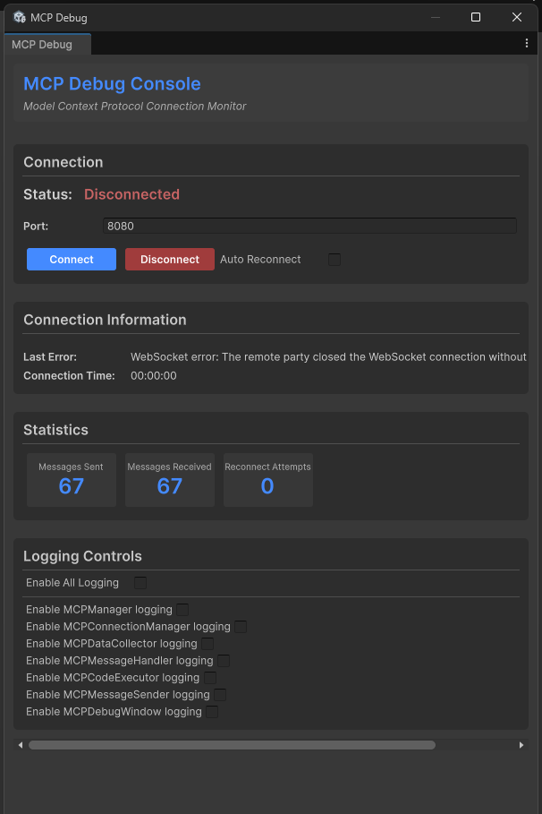

# Unity MCP Integration 

[](https://modelcontextprotocol.io/introduction)
[](https://smithery.ai/server/@quazaai/unitymcpintegration)
[](https://unity.com)
[](https://nodejs.org)
[](https://www.typescriptlang.org)
[](https://developer.mozilla.org/en-US/docs/Web/API/WebSockets_API)

[](https://github.com/quazaai/UnityMCPIntegration/stargazers)
[](https://github.com/quazaai/UnityMCPIntegration/network/members)
[](https://github.com/quazaai/UnityMCPIntegration/blob/main/LICENSE)
[](https://github.com/quazaai/UnityMCPIntegration/commits/main)

<div align="center">
  
</div>

This package provides a seamless integration between [Model Context Protocol (MCP)](https://modelcontextprotocol.io/) and Unity Editor, allowing AI assistants to understand and interact with your Unity projects in real-time. With this integration, AI assistants can access information about your scene hierarchy, project settings, and execute code directly in the Unity Editor context.

## 📚 What is MCP?

The Model Context Protocol (MCP) is a standardized protocol that connects AI models to tools and context sources. It enables AI assistants to:

- Access real-time information about your Unity project
- Understand your scene hierarchy and game objects
- Execute C# code directly in the Unity Editor
- Monitor logs and errors
- Control the Editor's play mode
- Browse and manipulate project files directly


## 🚀 Getting Started

### Prerequisites

- Unity 2021.3 or later
- Node.js 18+ (for running the MCP server)

### Installation

#### 1. Install Unity Package

You have several options to install the Unity package:

**Option A: Package Manager (Git URL)**
1. Open the Unity Package Manager (`Window > Package Manager`)
2. Click the `+` button and select `Add package from git URL...`
3. Enter the repository URL: `https://github.com/quazaai/UnityMCPIntegration.git`
4. Click `Add`

**Option B: Import Custom Package**
1. Clone this repository or download it as a zip
2. In Unity, go to `Assets > Import Package > Custom Package`
3. Select the `UnityMCPIntegration.unitypackage` file


#### 2. Set up the MCP Server

You have two options to run the MCP server:

**Option A: Run the server directly**

1. Navigate to the `mcpServer (likely <path-to-project>\Library\PackageCache\com.quaza.unitymcp@d2b8f1260bca\mcpServer\)` directory
2. Install dependencies:
   ```
   npm install
   ```
3. Run the server:
   ```
   node build/index.js
   ```

**Option B: Add to MCP Host configuration**

Add the server to your MCP Host configuration for Claude Desktop, Custom Implementation etc

```json
{
  "mcpServers": {
    "unity-mcp-server": {
      "command": "node",
      "args": [
        "path-to-project>\\Library\\PackageCache\\com.quaza.unitymcp@d2b8f1260bca\\mcpServer\\mcpServer\\build\\index.js"
      ],
      "env": {
        "MCP_WEBSOCKET_PORT": "5010"
      }
    }
  }
}
```
### Demo Video
[](https://www.youtube.com/watch?v=GxTlahBXs74)

### 🔧 Usage

#### Debugging and Monitoring

You can open the MCP Debug window in Unity to monitor the connection and test features:

1. Go to `Window > MCP Debug`
2. Use the debug window to:
   - Check connection status
   - Test code execution
   - View logs
   - Monitor events

#### Available Tools

The Unity MCP integration provides several tools to AI assistants:

##### Unity Editor Tools
- **get_editor_state**: Get comprehensive information about the Unity project and editor state
- **get_current_scene_info**: Get detailed information about the current scene
- **get_game_objects_info**: Get information about specific GameObjects in the scene
- **execute_editor_command**: Execute C# code directly in the Unity Editor
- **get_logs**: Retrieve and filter Unity console logs
- **verify_connection**: Check if there's an active connection to Unity Editor

##### Filesystem Tools
- **read_file**: Read contents of a file in your Unity project
- **read_multiple_files**: Read multiple files at once
- **write_file**: Create or overwrite a file with new content
- **edit_file**: Make targeted edits to existing files with diff preview
- **list_directory**: Get a listing of files and folders in a directory
- **directory_tree**: Get a hierarchical view of directories and files
- **search_files**: Find files matching a search pattern
- **get_file_info**: Get metadata about a specific file or directory
- **find_assets_by_type**: Find all assets of a specific type (e.g. Material, Prefab)
- **list_scripts**: Get a listing of all C# scripts in the project

File paths can be absolute or relative to the Unity project's Assets folder. For example, `"Scenes/MyScene.unity"` refers to `<project>/Assets/Scenes/MyScene.unity`.

## 🛠️ Architecture

The integration consists of two main components:

1. **Unity Plugin (C#)**: Resides in the Unity Editor and provides access to Editor APIs
2. **MCP Server (TypeScript/Node.js)**: Implements the MCP protocol and communicates with the Unity plugin

Communication between them happens via WebSocket, transferring JSON messages for commands and data.

## File System Access

The Unity MCP integration now includes powerful filesystem tools that allow AI assistants to:

- Browse, read, and edit files in your Unity project
- Create new files and directories
- Search for specific files or asset types
- Analyze your project structure
- Make targeted code changes with diff previews

All file operations are restricted to the Unity project directory for security. The system intelligently handles both absolute and relative paths, always resolving them relative to your project's Assets folder for convenience.

Example usages:
- Get a directory listing: `list_directory(path: "Scenes")`
- Read a script file: `read_file(path: "Scripts/Player.cs")`
- Edit a configuration file: `edit_file(path: "Resources/config.json", edits: [{oldText: "value: 10", newText: "value: 20"}], dryRun: true)`
- Find all materials: `find_assets_by_type(assetType: "Material")`

## 👥 Contributing

Contributions are welcome! Here's how you can contribute:

1. Fork the repository
2. Create a feature branch (`git checkout -b feature/amazing-feature`)
3. Make your changes
4. Commit your changes (`git commit -m 'Add some amazing feature'`)
5. Push to the branch (`git push origin feature/amazing-feature`)
6. Open a Pull Request

### Development Setup

**Unity Side**:
- Open the project in Unity
- Modify the C# scripts in the `UnityMCPConnection/Editor` directory

**Server Side**:
- Navigate to the `mcpServer` directory
- Install dependencies: `npm install`
- Make changes to the TypeScript files in the `src` directory
- Build the server: `npm run build`
- Run the server: `node build/index.js`

## 📄 License

This project is licensed under the MIT License - see the LICENSE file for details.

## 📞 Support

If you encounter any issues or have questions, please file an issue on the GitHub repository.
