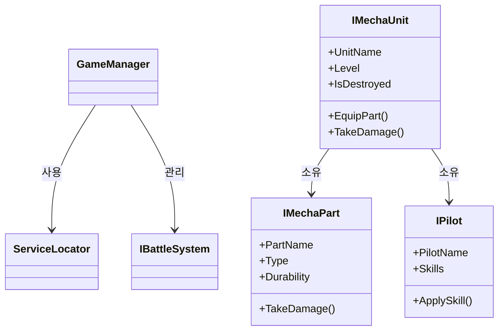

# Project-FM

Front Mission 스타일의 메카닉 커스터마이징 전략 RPG 게임 프로젝트입니다.

## 프로젝트 개요

Project-FM은 파일럿과 메카닉 유닛의 상호작용을 중심으로 한 전술 턴제 전투 게임입니다.
플레이어는 자신만의 메카닉 유닛을 커스터마이징하고, 다양한 파일럿을 모집하여 전략적 전투에 참여합니다.

## 문서

프로젝트의 설계 및 개발 문서는 다음과 같습니다:

### 게임 기획 및 설계
- [게임 컨셉](./docs/game-concept.md) - 게임의 핵심 컨셉과 주요 메커니즘에 대한 개요
- [기술 아키텍처](./docs/architecture.md) - 게임의 기술적 구조와 시스템 설계
- [프로젝트 구조](./docs/project-structure.md) - 유니티 프로젝트 폴더 구조 및 네이밍 컨벤션
- [데이터 플로우 및 상태 관리](./docs/data-flow.md) - 게임 데이터 흐름과 상태 관리 방식
- [에셋 파이프라인](./docs/asset-pipeline.md) - 에셋 관리 및 리소스 파이프라인
- [클래스 다이어그램](./docs/class-diagram.md) - 주요 클래스 및 인터페이스 관계도 (Mermaid 문법 활용)

### 주요 클래스 관계 미리보기

## 개발 정보

- **엔진**: Unity 2022.3 LTS
- **언어**: C#
- **플랫폼**: 모바일 (Android, iOS)
- **개발 단계**: 프로토타이핑
- **문서화 도구**: Markdown, Mermaid 다이어그램

## 프로토타입 목표

현재 프로토타입 단계에서는 텍스트 기반 스크롤뷰 형식의 전투 시스템을 구현하여 게임의 코어 메카니즘을 테스트하는 데 집중하고 있습니다.

## 주요 특징

- **메카닉 커스터마이징**: 다양한 부품으로 메카닉 유닛 제작
- **파트 파괴 시스템**: 부위별 데미지 계산 시스템
- **파일럿 관리**: 다양한 능력과 특성을 가진 파일럿 육성
- **전략적 전투**: 턴제 기반의 전술적 깊이가 있는 전투
- **인터페이스 중심 설계**: 확장성과 유지보수를 고려한 인터페이스 기반 아키텍처

## 기술적 접근

- **인터페이스 기반 설계**: 모든 주요 시스템은 인터페이스를 통해 정의되어 확장성 보장
- **ScriptableObject 데이터 관리**: 게임 데이터는 ScriptableObject를 통해 에디터 친화적으로 관리
- **Odin Inspector 활용**: 프로토타이핑 및 에디터 확장을 위한 Odin Inspector 활용
- **시각적 문서화**: Mermaid 다이어그램을 통한 클래스 관계 시각화

## 참고

문서들은 지속적으로 업데이트될 예정입니다. 문서 작성과 관련된 제안이나 질문은 프로젝트 관리자에게 문의해주세요.