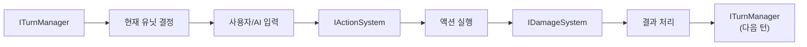
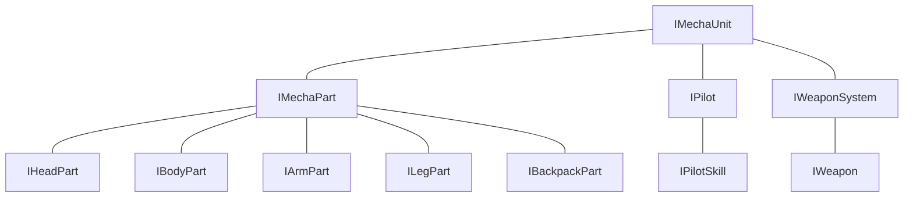

# Project-FM: 시스템 아키텍처 설계

**작성일:** 2025년 4월 11일  
**작성자:** SASHA  
**문서 상태:** 초안 (프로토타입 단계)
**참고 사항:** 이 문서는 인터페이스 및 시스템 관계에 집중합니다. 폴더 구조는 `project-structure.md` 문서를 참조하세요.

## 1. 시스템 개요

Project-FM은 모듈식 설계 원칙을 따르는 유니티 기반 메카닉 커스터마이징 게임입니다. 이 문서는 프로젝트의 기본 아키텍처 설계를 설명합니다.

## 2. 프로토타이핑 접근 방식

### 2.1 프로토타입 우선 설계
프로젝트의 초기 단계에서는 상세한 아키텍처 설계보다 핵심 메커니즘의 프로토타이핑에 집중합니다:
- 메카닉 파트 시스템과 조합 테스트
- 파트별 파괴 시스템 동작 검증
- 전투 흐름 직접 테스트

### 2.2 Odin Inspector 활용
Odin Inspector를 활용하여 다음과 같은 개발 프로세스를 개선합니다:
- 인스펙터에 테스트 버튼을 추가하여 빠른 메커니즘 검증
- 직관적인 데이터 시각화로 개발 속도 향상
- 복잡한 데이터 구조의 편리한 편집

```csharp
// 프로토타입 테스트 예시 (인터페이스 기반)
public class MechaPrototype : MonoBehaviour
{
    [BoxGroup("기본 정보")]
    public string mechaName;
    
    [BoxGroup("메카닉 파트")]
    [InlineEditor]
    public IMechaPartData bodyPart;
    
    [BoxGroup("메카닉 파트")]
    [InlineEditor]
    public IMechaPartData leftArmPart;
    
    [BoxGroup("메카닉 파트")]
    [InlineEditor]
    public IMechaPartData rightArmPart;
    
    [BoxGroup("메카닉 파트")]
    [InlineEditor]
    public IMechaPartData legPart;
    
    [BoxGroup("메카닉 파트")]
    [InlineEditor]
    public IMechaPartData backpackPart;
    
    [Button("전투 시뮬레이션 테스트")]
    private void TestCombat()
    {
        // 전투 시뮬레이션 로직
        Debug.Log("전투 시뮬레이션 실행 중...");
    }
    
    [Button("파트 파괴 테스트", ButtonSizes.Large)]
    [GUIColor(1, 0.5f, 0.5f)]
    private void TestPartDestruction(IPartType partType)
    {
        // 파트 파괴 로직 테스트
        Debug.Log($"{partType} 파트 파괴 테스트 실행...");
    }
}
```

## 3. 핵심 시스템 구조

이 섹션에서는 각 시스템의 인터페이스 구조와 컴포넌트 관계를 설명합니다. 실제 파일 및 폴더 구조는 `project-structure.md` 문서의 표준을 따릅니다.

### 3.1 메카닉 시스템
메카닉 시스템은 다음과 같은 주요 인터페이스로 구성됩니다:

- **IMechaUnit**: 메카닉 유닛의 기본 인터페이스
- **IMechaPart**: 메카닉 파트의 기본 인터페이스
- **IWeaponSystem**: 무기 시스템 인터페이스
- **IHeadPart**, **IBodyPart**, **IArmPart**, **ILegPart**, **IBackpackPart**: 각 파트 타입별 인터페이스
- **IDamageSystem**, **IPartDestructionSystem**, **IStatusEffectSystem**: 전투 관련 인터페이스

### 3.2 파일럿 시스템
파일럿 시스템은 다음과 같은 주요 인터페이스로 구성됩니다:

- **IPilot**: 파일럿 인터페이스
- **IPilotSkill**: 파일럿 스킬 인터페이스
- **IPilotProgressionSystem**: 파일럿 성장 시스템 인터페이스
- **IPilotDatabase**: 파일럿 데이터베이스 인터페이스

### 3.3 전투 시스템
전투 시스템은 다음과 같은 주요 인터페이스로 구성됩니다:

- **ITurnManager**: 턴 관리 인터페이스
- **IBattleGrid**: 전투 그리드 인터페이스
- **IMovementSystem**: 이동 시스템 인터페이스
- **IActionSystem**: 행동 시스템 인터페이스
- **IAIController**: AI 제어 인터페이스
- **IEnvironmentInteraction**: 환경 상호작용 인터페이스

### 3.4 UI 시스템
UI 시스템은 다음과 같은 주요 인터페이스로 구성됩니다:

- **IUIPanel**: UI 패널 인터페이스
- **IUIManager**: UI 매니저 인터페이스
- **IUIElement**: UI 요소 인터페이스

### 3.5 데이터 관리
데이터 관리 시스템은 다음과 같은 주요 인터페이스로 구성됩니다:

- **ISaveSystem**: 저장 시스템 인터페이스
- **IDataRepository**: 데이터 저장소 인터페이스
- **IAssetManager**: 에셋 관리 인터페이스
- **IMechaPartData**, **IPilotData**, **IWeaponData**: 스크립터블 오브젝트 데이터 인터페이스

## 4. 데이터 흐름

### 4.1 메카닉 커스터마이징 흐름


### 4.2 전투 흐름


### 4.3 파일럿 관리 흐름


## 5. 인터페이스 및 추상 클래스 설계

### 5.1 IMechaUnit 인터페이스
```csharp
/// <summary>
/// 메카닉 유닛의 기본 인터페이스
/// </summary>
public interface IMechaUnit
{
    // 기본 속성
    string UnitName { get; }
    int Level { get; }
    bool IsDestroyed { get; }
    
    // 파트 참조
    IMechaPart Head { get; }
    IMechaPart Body { get; }
    IMechaPart LeftArm { get; }
    IMechaPart RightArm { get; }
    IMechaPart Legs { get; }
    IMechaPart Backpack { get; }
    
    // 파일럿 참조
    IPilot CurrentPilot { get; }
    
    // 메서드
    void Initialize();
    void EquipPart(IMechaPart part);
    void AssignPilot(IPilot pilot);
    void CalculateStats();
    void TakeDamage(int damage, PartType targetPart);
    void CheckDestructionStatus();
}
```

### 5.2 IMechaPart 인터페이스
```csharp
/// <summary>
/// 메카닉 파트의 기본 인터페이스
/// </summary>
public interface IMechaPart
{
    // 기본 속성
    string PartName { get; }
    PartType Type { get; }
    int Durability { get; }
    int MaxDurability { get; }
    bool IsDestroyed { get; }
    
    // 스탯 관련
    IDictionary<StatType, int> StatModifiers { get; }
    
    // 메서드
    void Initialize();
    void TakeDamage(int damage);
    void OnDestruction();
    void Repair(int amount);
}
```

### 5.3 IPilot 인터페이스
```csharp
/// <summary>
/// 파일럿의 기본 인터페이스
/// </summary>
public interface IPilot
{
    // 기본 속성
    string PilotName { get; }
    int Level { get; }
    PilotClass Class { get; }
    
    // 스탯 및 스킬
    IReadOnlyDictionary<PilotStat, int> Stats { get; }
    IReadOnlyCollection<IPilotSkill> Skills { get; }
    
    // 메서드
    void Initialize();
    void GainExperience(int amount);
    void LevelUp();
    void LearnSkill(IPilotSkill skill);
    int GetStatValue(PilotStat stat);
}
```

## 6. 프로토타입 테스트 계획

### 6.1 테스트 시나리오
1. **메카닉 조립 테스트**: 다양한 파트 조합의 스탯 계산 검증
2. **전투 샘플 테스트**: 단순화된 전투 상황에서 데미지 계산 및 파트 파괴 시스템 테스트
3. **파일럿 능력 테스트**: 파일럿 스킬과 메카닉 상호작용 테스트

### 6.2 테스트 데이터
- 테스트용 더미 메카닉 파트 데이터
- 간단한 파일럿 프로필
- 기본 무기 및 전투 수치

### 6.3 인터페이스 테스트
- Odin Inspector로 구성된 편집 환경 사용성 테스트
- 주요 메커니즘에 대한 버튼 테스트 기능 구현

## 7. 확장성 계획

### 7.1 새로운 파트 타입
- 새로운 파트 타입 인터페이스 설계
- 플러그인 시스템을 위한 인터페이스 고려

### 7.2 멀티플레이어 지원
- 멀티플레이어 기능을 위한 인터페이스 설계
- 네트워크 동기화를 위한 인터페이스 준비

### 7.3 모드 지원
- 커스텀 메카닉 파츠 및 파일럿을 위한 확장 가능한 인터페이스 설계
- 에디터 확장 인터페이스 준비

---

## 부록: 인터페이스 의존성 다이어그램

