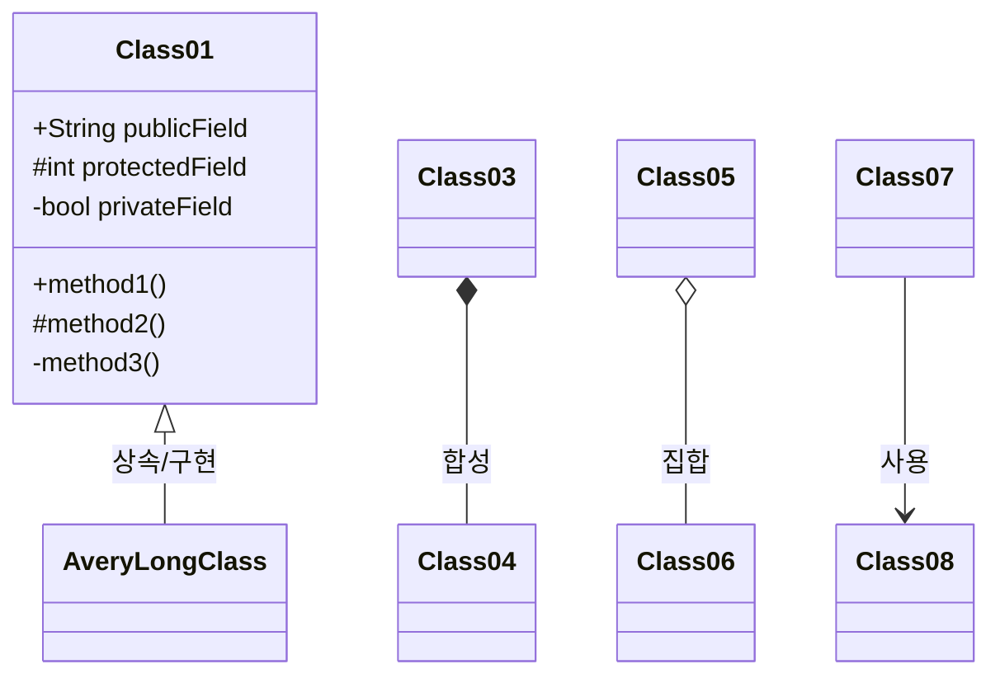
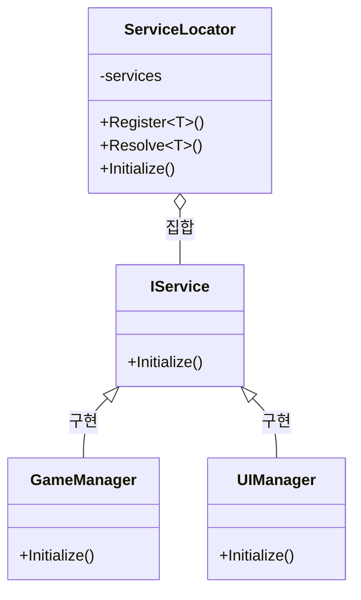
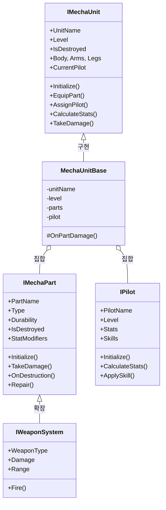
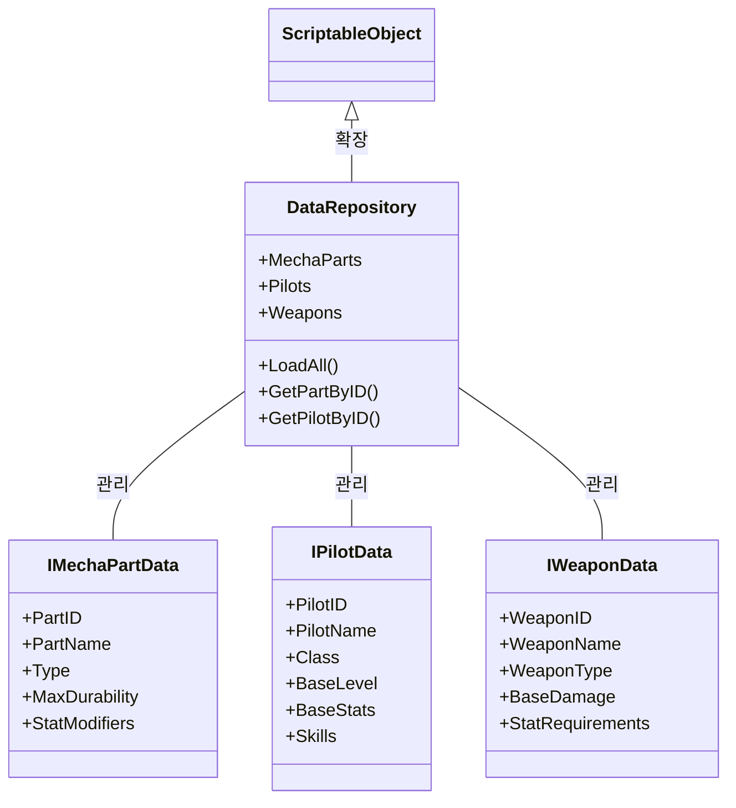
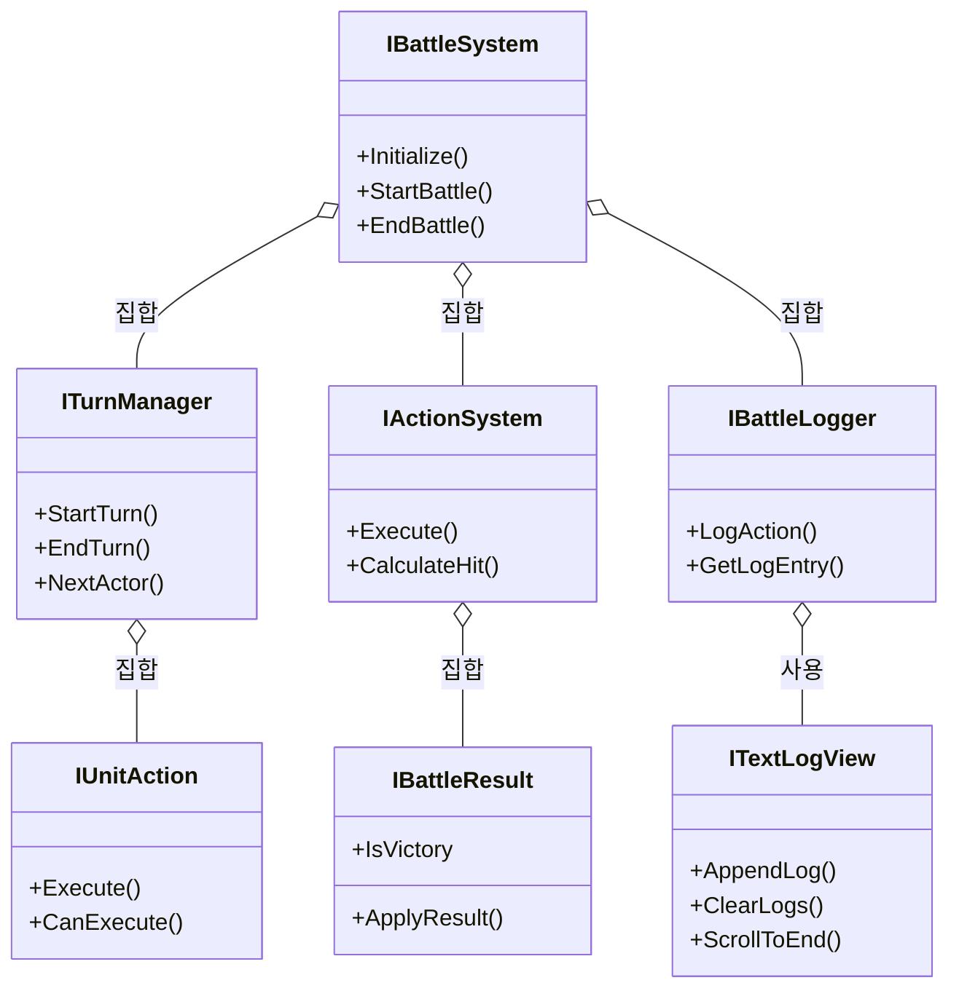
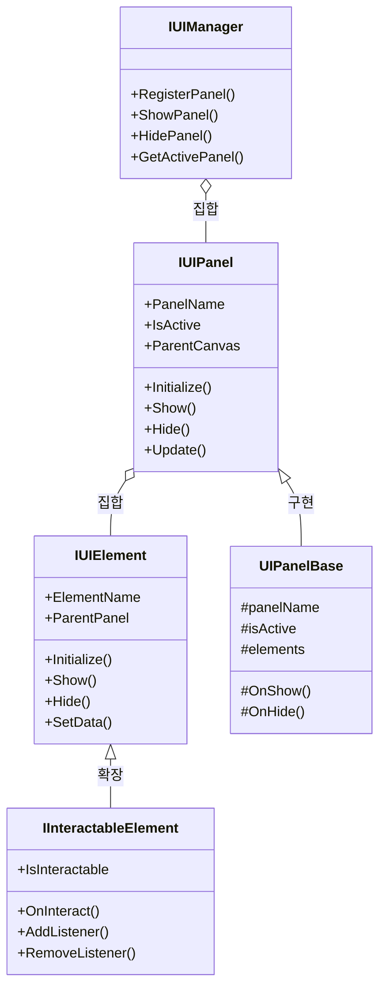
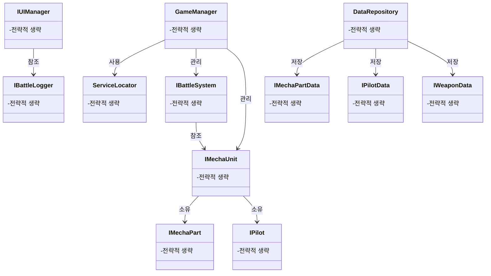

# Project-FM: 클래스 다이어그램

**작성일:** 2025년 4월 11일  
**작성자:** SASHA  
**문서 상태:** 초안 (프로토타입 단계)
**참고 사항:** 이 문서는 프로젝트의 주요 클래스 및 인터페이스 관계에 집중합니다. 폴더 구조는 `project-structure.md` 문서를 참조하세요.

## 1. 다이어그램 개요

이 문서는 Project-FM의 주요 인터페이스와 클래스 간의 관계를 다이어그램으로 시각화합니다. 프로젝트의 아키텍처(`architecture.md`)와 데이터 흐름(`data-flow.md`) 문서를 기반으로 작성되었으며, 폴더 구조는 `project-structure.md`에 정의된 표준을 따릅니다.

## 2. Mermaid 다이어그램 표기법

이 문서에서는 클래스 다이어그램을 표현하기 위해 Mermaid 문법을 사용합니다:



관계 표현:
- 상속/구현: `<|--`
- 합성: `*--`
- 집합: `o--`
- 사용: `-->`

## 3. 핵심 시스템 클래스 다이어그램

### 3.1 서비스 로케이터 및 구조적 패턴 (Core 네임스페이스)



네임스페이스 구조:
```csharp
namespace ProjectFM.Core.Interfaces
{
    public interface IService
    {
        void Initialize();
    }
}

namespace ProjectFM.Core
{
    public class ServiceLocator
    {
        // 구현
    }
}
```

### 3.2 메카닉 시스템 클래스 다이어그램 (Mecha 네임스페이스)



네임스페이스 구조:
```csharp
namespace ProjectFM.Mecha.Interfaces
{
    public interface IMechaUnit
    {
        // 구현
    }
    
    public interface IMechaPart
    {
        // 구현
    }
}

namespace ProjectFM.Mecha.Abstract
{
    public abstract class MechaUnitBase : IMechaUnit
    {
        // 구현
    }
}
```

### 3.3 데이터 관리 클래스 다이어그램 (ScriptableObjects 구조)



ScriptableObject 구현:
```csharp
// project-structure.md에 정의된 네이밍 컨벤션을 따름
namespace ProjectFM.Data
{
    [CreateAssetMenu(fileName = "NewMechaPart", menuName = "ProjectFM/MechaPart")]
    public class MechaPartData : ScriptableObject, IMechaPartData
    {
        [SerializeField] private string _partID;
        [SerializeField] private string _partName;
        
        // IMechaPartData 인터페이스 구현
        public string PartID => _partID;
        public string PartName => _partName;
        // 추가 구현...
    }
}
```

### 3.4 전투 시스템 클래스 다이어그램 (Battle 네임스페이스)



전투 시스템 네임스페이스:
```csharp
namespace ProjectFM.Battle.Interfaces
{
    public interface ITurnManager
    {
        bool IsBattleActive { get; }
        bool CanRewind { get; }
        void StartBattle();
        void ResetBattle();
        // 추가 구현...
    }
}
```

### 3.5 UI 시스템 클래스 다이어그램 (UI 네임스페이스)



## 4. 관계 종합 다이어그램

아래 다이어그램은 주요 시스템 간의 관계를 종합적으로 보여줍니다:



## 5. 참고자료

- 이 다이어그램은 `project-structure.md`에 정의된 폴더 구조를 기반으로 작성되었습니다.
- 인터페이스와 추상 클래스 관계는 `architecture.md` 문서를 참조하였습니다.
- 데이터 관계는 `data-flow.md` 문서에 자세히 설명되어 있습니다. 