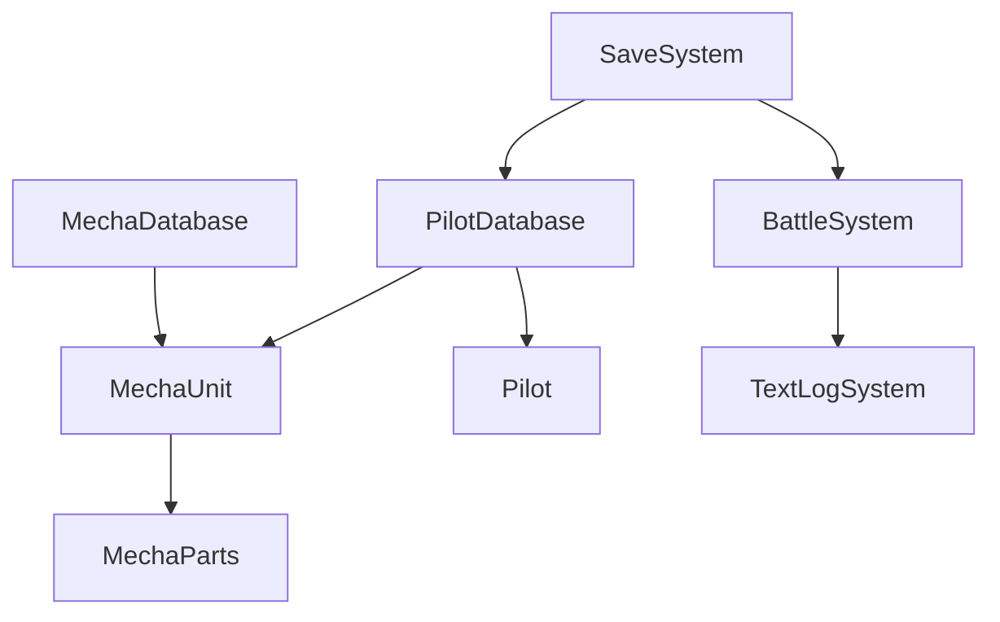
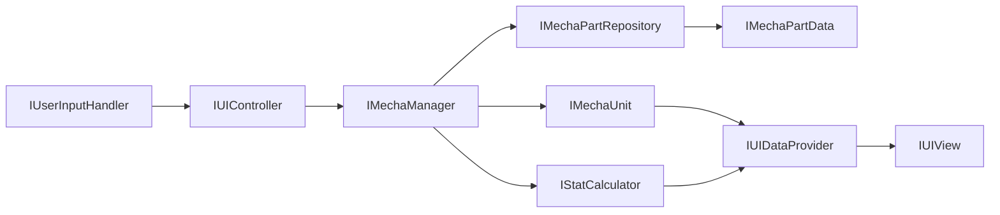
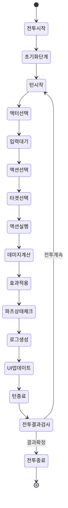
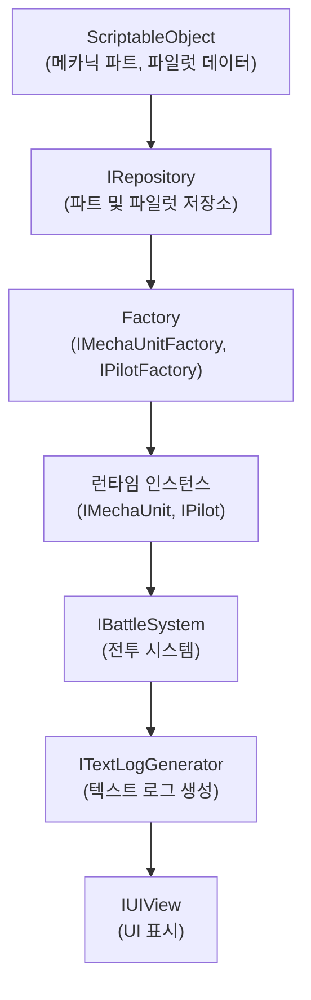

# Project-FM: 데이터 플로우 및 상태 관리 설계

**작성일:** 2025년 4월 11일  
**작성자:** SASHA  
**문서 상태:** 초안 (프로토타입 단계)
**참고 사항:** 이 문서는 데이터 흐름 및 상태 관리에 집중합니다. 폴더 구조는 `project-structure.md` 문서를 참조하세요.

## 1. 데이터 플로우 개요

이 문서는 Project-FM의 데이터 흐름과 상태 관리 방식에 대한 설계를 정의합니다. 프로토타입 단계에서는 텍스트 기반 전투 시스템을 중심으로 데이터가 어떻게 흐르고 관리되는지 설명합니다.

### 1.1 핵심 데이터 시스템
- **메카닉 파츠 시스템**: 파츠 데이터 구조 및 관리
- **파일럿 시스템**: 파일럿 데이터 및 능력 관리
- **전투 시스템**: 턴제 전투 상태 및 플로우 관리
- **텍스트 로그 시스템**: 전투 결과 및 액션 로깅
- **저장 시스템**: 게임 데이터 저장 및 로드

### 1.2 데이터 구조 개요



## 2. 주요 데이터 흐름

### 2.1 메카닉 커스터마이징 데이터 흐름

```
1. 사용자 입력 → UI 컨트롤러
2. UI 컨트롤러 → 메카닉 매니저
3. 메카닉 매니저 → 파트 데이터 로드 (ScriptableObject)
4. 메카닉 매니저 → 메카닉 유닛 업데이트
5. 메카닉 유닛 → 스탯 재계산
6. 메카닉 유닛 → UI 상태 업데이트
```

#### 2.1.1 인터페이스 기반 데이터 흐름 다이어그램



### 2.2 텍스트 기반 전투 시스템 데이터 흐름

```
1. 전투 시작 → 초기 상태 설정
2. ITurnManager → 현재 액터 결정
3. 액터 AI/사용자 입력 → IActionSystem
4. IActionSystem → 액션 실행
5. 액션 실행 → ITextLogGenerator → ITextLogView
6. 액션 결과 → IMechaUnit 상태 업데이트
7. 턴 종료 → ITurnManager → 다음 턴
```

#### 2.2.1 전투 상태 전이 다이어그램



## 3. ScriptableObject 기반 데이터 관리

### 3.1 메카닉 파츠 데이터 구조

```csharp
// 메카닉 파트 데이터 인터페이스
public interface IMechaPartData
{
    string PartID { get; }
    string PartName { get; }
    PartType Type { get; }
    int BaseMaxDurability { get; }
    IDictionary<StatType, int> StatModifiers { get; }
    ISpecialEffect[] SpecialEffects { get; }
}

// ScriptableObject 구현체
[CreateAssetMenu(fileName = "NewMechaPart", menuName = "ProjectFM/MechaPart")]
public class MechaPartData : ScriptableObject, IMechaPartData
{
    [SerializeField] private string partID;
    [SerializeField] private string partName;
    [SerializeField] private PartType type;
    [SerializeField] private int baseMaxDurability;
    [SerializeField] private StatModifier[] statModifiers;
    [SerializeReference] private SpecialEffect[] specialEffects;
    
    // IMechaPartData 인터페이스 구현
}
```

### 3.2 파일럿 데이터 구조

```csharp
// 파일럿 데이터 인터페이스
public interface IPilotData
{
    string PilotID { get; }
    string PilotName { get; }
    PilotClass Class { get; }
    int BaseLevel { get; }
    IDictionary<PilotStat, int> BaseStats { get; }
    IPilotSkillData[] Skills { get; }
}

// ScriptableObject 구현체
[CreateAssetMenu(fileName = "NewPilot", menuName = "ProjectFM/Pilot")]
public class PilotData : ScriptableObject, IPilotData
{
    [SerializeField] private string pilotID;
    [SerializeField] private string pilotName;
    [SerializeField] private PilotClass pilotClass;
    [SerializeField] private int baseLevel;
    [SerializeField] private PilotStatItem[] baseStats;
    [SerializeReference] private PilotSkillData[] skills;
    
    // IPilotData 인터페이스 구현
}
```

### 3.3 전투 파라미터 데이터

```csharp
// 전투 파라미터 인터페이스
public interface IBattleParametersData
{
    int BaseHitChance { get; }
    int BaseCritChance { get; }
    float CritDamageMultiplier { get; }
    int BaseEvasion { get; }
    AnimationCurve AccuracyDistanceCurve { get; }
}

// ScriptableObject 구현체
[CreateAssetMenu(fileName = "BattleParameters", menuName = "ProjectFM/BattleParameters")]
public class BattleParametersData : ScriptableObject, IBattleParametersData
{
    [SerializeField] private int baseHitChance = 80;
    [SerializeField] private int baseCritChance = 5;
    [SerializeField] private float critDamageMultiplier = 1.5f;
    [SerializeField] private int baseEvasion = 10;
    [SerializeField] private AnimationCurve accuracyDistanceCurve;
    
    // IBattleParametersData 인터페이스 구현
}
```

## 4. 전투 로그 및 상태 관리

### 4.1 텍스트 로그 생성 및 관리

```csharp
// 텍스트 로그 데이터 인터페이스
public interface ITextLogEntry
{
    LogEntryType Type { get; }
    string Message { get; }
    DateTime Timestamp { get; }
    object[] Parameters { get; }
}

// 텍스트 로그 생성기 인터페이스
public interface ITextLogGenerator
{
    ITextLogEntry CreateActionLog(IAction action, IActionResult result);
    ITextLogEntry CreateMovementLog(IUnit unit, Vector2Int fromPosition, Vector2Int toPosition);
    ITextLogEntry CreateDamageLog(IUnit attacker, IUnit target, int damage, PartType targetPart);
    ITextLogEntry CreateDestructionLog(IUnit unit, PartType destroyedPart);
    ITextLogEntry CreateStatusEffectLog(IUnit unit, IStatusEffect effect);
}

// 텍스트 로그 관리자 인터페이스
public interface ITextLogManager
{
    IReadOnlyList<ITextLogEntry> CurrentBattleLogs { get; }
    int LogCount { get; }
    
    void AddLog(ITextLogEntry logEntry);
    void ClearLogs();
    ITextLogEntry[] GetLatestLogs(int count);
    ITextLogEntry[] GetLogsByType(LogEntryType type);
}
```

### 4.2 전투 상태 관리

```csharp
// 전투 상태 인터페이스
public interface IBattleState
{
    BattlePhase CurrentPhase { get; }
    int CurrentTurn { get; }
    IUnit CurrentActor { get; }
    IReadOnlyList<IUnit> PlayerUnits { get; }
    IReadOnlyList<IUnit> EnemyUnits { get; }
    
    IBattleGrid BattleGrid { get; }
    ITextLogManager LogManager { get; }
    
    bool IsPlayerTurn { get; }
    bool IsBattleOver { get; }
    BattleResult GetBattleResult();
}

// 턴 관리자 인터페이스
public interface ITurnManager
{
    int CurrentTurn { get; }
    IUnit CurrentActor { get; }
    IReadOnlyList<IUnit> TurnOrder { get; }
    
    void StartBattle();
    void EndBattle();
    void NextTurn();
    void EndCurrentTurn();
    
    void RegisterUnit(IUnit unit);
    void UnregisterUnit(IUnit unit);
    
    event System.Action<IUnit> OnActorChanged;
    event System.Action<int> OnTurnChanged;
}
```

## 5. 저장 시스템

### 5.1 저장 시스템 인터페이스

```csharp
// 저장 시스템 인터페이스
public interface ISaveSystem
{
    bool SaveExists(string saveSlot);
    bool SaveGame(string saveSlot, GameSaveData saveData);
    GameSaveData LoadGame(string saveSlot);
    bool DeleteSave(string saveSlot);
    string[] GetAllSaveSlots();
}

// 게임 저장 데이터 인터페이스
public interface IGameSaveData
{
    string SaveVersion { get; }
    DateTime SaveDate { get; }
    
    IMechaUnitSaveData[] PlayerMechs { get; }
    IPilotSaveData[] PlayerPilots { get; }
    IInventorySaveData Inventory { get; }
    IProgressSaveData Progress { get; }
}
```

### 5.2 프로토타입 단계 간소화된 저장 시스템

프로토타입 단계에서는 간소화된 저장 시스템을 사용합니다:

```csharp
// 프로토타입용 저장 시스템 구현
public class PrototypeSaveSystem : ISaveSystem
{
    // Unity PlayerPrefs를 사용한 간단한 직렬화 구현
    public bool SaveGame(string saveSlot, GameSaveData saveData)
    {
        string jsonData = JsonUtility.ToJson(saveData);
        PlayerPrefs.SetString("Save_" + saveSlot, jsonData);
        PlayerPrefs.Save();
        return true;
    }
    
    public GameSaveData LoadGame(string saveSlot)
    {
        string jsonData = PlayerPrefs.GetString("Save_" + saveSlot, "");
        return JsonUtility.FromJson<GameSaveData>(jsonData);
    }
    
    // ISaveSystem 인터페이스 구현
}
```

## 6. 런타임 데이터 관리

### 6.1 인터페이스 기반 종속성 관리

```csharp
// 서비스 로케이터 패턴
public static class ServiceLocator
{
    private static Dictionary<Type, object> _services = new Dictionary<Type, object>();
    
    public static void RegisterService<T>(T service) where T : class
    {
        _services[typeof(T)] = service;
    }
    
    public static T GetService<T>() where T : class
    {
        if (_services.TryGetValue(typeof(T), out object service))
        {
            return (T)service;
        }
        
        throw new System.InvalidOperationException($"Service {typeof(T).Name} not registered");
    }
}

// 예시 사용법
ServiceLocator.RegisterService<IMechaPartRepository>(new MechaPartRepository());
ServiceLocator.RegisterService<IPilotRepository>(new PilotRepository());
ServiceLocator.RegisterService<ITextLogManager>(new TextLogManager());

// 런타임에 서비스 가져오기
var mechaRepository = ServiceLocator.GetService<IMechaPartRepository>();
```

### 6.2 메카닉 및 파일럿 인스턴스 데이터 플로우



## 7. 프로토타입 개발 우선순위

### 7.1 데이터 시스템 구현 순서

1. ScriptableObject 기반 데이터 구조 정의 (메카닉 파트, 파일럿)
2. 인터페이스 기반 런타임 컴포넌트 구현 (유닛, 파트, 파일럿)
3. 텍스트 로그 시스템 구현
4. 턴제 전투 상태 관리 구현
5. 간단한 UI 시스템 구현
6. 간소화된 저장 시스템 구현

### 7.2 추후 고려 사항

- 데이터의 확장성을 위한 상세 설계
- 그래픽 기반 시스템으로 전환 시 데이터 구조 확장
- 멀티플레이어를 위한 데이터 동기화 방안
- 더 복잡한 전투 및 커스터마이징 시스템 지원

---

## 부록: 데이터 타입 정의

### A.1 상태 및 열거형

```csharp
// 파트 타입 열거형
public enum PartType
{
    Body,
    LeftArm,
    RightArm,
    Legs,
    Backpack
}

// 스탯 타입 열거형
public enum StatType
{
    Attack,
    Defense,
    Mobility,
    Energy,
    Accuracy,
    Evasion,
    CriticalRate
}

// 파일럿 스탯 열거형
public enum PilotStat
{
    Reflexes,
    Gunnery,
    Melee,
    Tactics,
    Engineering,
    Leadership
}

// 파일럿 클래스 열거형
public enum PilotClass
{
    Striker,
    Defender,
    Support,
    Commander
}

// 전투 단계 열거형
public enum BattlePhase
{
    Initialization,
    TurnStart,
    UnitSelection,
    ActionSelection,
    ActionExecution,
    TurnEnd,
    BattleEnd
}

// 로그 엔트리 타입 열거형
public enum LogEntryType
{
    Movement,
    Attack,
    Damage,
    PartDestruction,
    StatusEffect,
    TurnChange,
    BattleEvent
}

// 전투 결과 열거형
public enum BattleResult
{
    InProgress,
    PlayerVictory,
    PlayerDefeat,
    Draw
}
```

**참고**: 이 문서는 프로토타입 단계의 데이터 플로우 및 상태 관리 설계를 설명합니다. 실제 개발 과정에서 필요에 따라 수정될 수 있습니다.